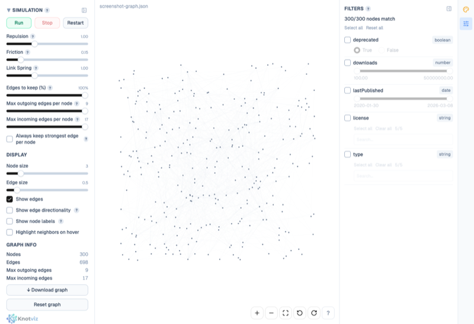

# Knotviz

Graph visualization in the browser. GPU-accelerated via WebGL, private by default (your data never leaves the page). Drop a file, explore, filter, colour, export — in any of five interchangeable formats (JSON, CSV edge list, CSV pair, GraphML, GEXF).



**Full user guide, input-format reference, and feature walkthroughs: [knotviz.com/docs](https://knotviz.com/docs).** This README covers repo setup, stack, scripts, and tests.

## Quick Start

```bash
npm install
npm run dev
```

Open `http://localhost:5173`, then drop a graph file onto the drop zone.

## Capacity

Useful ceiling: **~1M nodes** on a laptop (up to ~2M for strongly clustered graphs; below 500k everything is instant). Past 1M, pan/zoom framerate drops and the simulation grid starts to saturate — filter/search/colour can still carve a useful view out of larger files, but layout stops being legible.

Per-format load ceilings (where the tab eventually OOMs) and the full breakdown live at [knotviz.com/docs/limits](https://knotviz.com/docs/limits).

## Tech Stack

| Concern | Library |
|---|---|
| Framework | React 19 + TypeScript (strict) |
| Graph rendering + simulation | @cosmos.gl/graph (GPU-accelerated WebGL) |
| UI components | shadcn/ui v4 (Base UI primitives) |
| Icons | Lucide React |
| Styling | Tailwind CSS v4 |
| Build tool | Vite 8 |
| State management | Zustand |
| Unit testing | Vitest |
| Component testing | Vitest Browser Mode (Playwright provider) |
| E2E testing | Playwright |
| Linting | ESLint 9 + Prettier |

## Scripts

| Command | Description |
|---|---|
| `npm run dev` | Start dev server |
| `npm run build` | Production build (typecheck + bundle) |
| `npm run test:all` | **Full gate** — typecheck + lint + unit + component + E2E |
| `npm run verify` | Typecheck + lint + unit + component tests (no E2E) |
| `npm run test` | Unit + component tests (Vitest) |
| `npm run test:unit` | Unit tests only |
| `npm run test:component` | Component tests only (real Chromium via Vitest Browser Mode) |
| `npm run test:e2e` | E2E tests (Playwright — Chromium) |
| `npm run test:e2e:ui` | E2E tests with interactive Playwright UI |
| `npm run typecheck` | TypeScript type checking |
| `npm run lint` | ESLint |
| `npm run format` | Prettier formatting |

### Editing code imported by the loading worker

The file-loading pipeline (`src/graph/workers/loadingWorker.ts` and everything it imports — parsers, `GraphBuilder`, `typeDetection`, etc.) runs inside a Web Worker. Vite bundles this worker via the `?worker` import suffix; when you edit any file in its import graph, Vite issues a **full page reload** rather than an in-place HMR update, because the worker module has to be re-instantiated to pick up the new code. You'll see `[vite] (client) page reload <file>` in the dev-server log.

In practice: just save and the browser tab reloads. Drop your test file again to exercise the new code path. No `npm run dev` restart needed. If you ever see stale behaviour after an edit (rare), hard-reload the tab (`Cmd+Shift+R` / `Ctrl+Shift+R`) to force the worker bundle to re-fetch.

## Testing

Three tiers, all gated by `npm run test:all` (four GPU-dependent tests skip in headless SwiftShader):

- **Unit** (`src/graph/test/`) — pure-function coverage: graph building, validation, null defaults, property-type detection, streaming parsers, gradient/highlight computation, appearance utilities, stats, edge filtering, substring match.
- **Component** (`src/graph/components/__tests__/`) — React components in real Chromium via Vitest Browser Mode: canvas controls, node tooltip, sidebar design system, filter UI (boolean / number / string / date), statistics panel.
- **E2E** (`e2e/`) — Playwright specs for every user-visible flow: drop zone, filters, colour / size, search + autocomplete, rotation, histogram, reset & export, file replacement, homepage, zero-edge graphs, position-aware loading.

Contributor-focused details live in [`CONTRIBUTING.md`](./CONTRIBUTING.md).

## Project Structure

```
knotviz/
├── index.html                  # Homepage (/), static HTML + Tailwind
├── graph/index.html            # Graph SPA entry (/graph)
├── docs/                       # Astro Starlight docs site (knotviz.com/docs)
├── e2e/                        # Playwright E2E tests + fixtures
├── src/
│   ├── styles/globals.css      # Shared Tailwind theme
│   ├── homepage/main.ts        # Homepage CSS entry
│   ├── graph/                  # Graph mini-app — all graph code
│   │   ├── main.tsx, App.tsx, types.ts
│   │   ├── components/         # Canvas, sidebars, filters, tooltip, drop zone
│   │   ├── hooks/              # useCosmos (cosmos lifecycle), useFilterState, useFileDrop, …
│   │   ├── workers/            # loadingWorker (parse), appearanceWorker (filter + gradient + highlight)
│   │   ├── lib/                # Pure functions: parsers, graphBuilder, typeDetection, gradient, stats, …
│   │   ├── stores/             # Zustand store
│   │   └── test/               # Unit tests
│   └── shared/                 # Code shared between apps
├── public/, scripts/
└── playwright.config.ts, vite.config.ts, tsconfig.json, eslint.config.js
```

See [`CONTRIBUTING.md`](./CONTRIBUTING.md) for the contributor-facing architecture notes.

## Generating Test Graphs

```bash
python3 scripts/generate_large_graph.py
```

Generates 2M, 3M, 4M, and 5M node graphs in `graphs_for_manual_testing/`. Each node has 4 property types (number, string, boolean, date). Edge distribution: 50% one edge, 30% two, 20% three per node.

## License

MIT — see [LICENSE](LICENSE).
